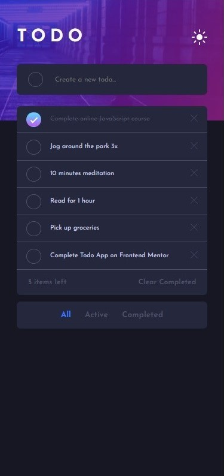

# Frontend Mentor - Todo app solution

This is a solution to the [Todo app challenge on Frontend Mentor](https://www.frontendmentor.io/challenges/todo-app-Su1_KokOW). Frontend Mentor challenges help you improve your coding skills by building realistic projects.

## Table of contents

- [Overview](#overview)
  - [The challenge](#the-challenge)
  - [Screenshot](#screenshot)
  - [Links](#links)
- [My process](#my-process)
  - [Built with](#built-with)
  - [What I learned](#what-i-learned)
  - [Continued development](#continued-development)
- [Author](#author)

## Overview

### The challenge

Users should be able to:

- View the optimal layout for the app depending on their device's screen size
- See hover states for all interactive elements on the page
- Add new todos to the list
- Mark todos as complete
- Delete todos from the list
- Filter by all/active/complete todos
- Clear all completed todos
- Toggle light and dark mode

### Screenshot

### Links

- Solution URL: [Frontend Mentor](https://www.frontendmentor.io/solutions/fullstacktodolistapplication-LmG1pcvePz)
- Live Site URL: [Render](https://katrine-pedersen-to-do-list-app.onrender.com/)

## My process

### Built with

- **Frontend:**

  - HTML
  - CSS custom properties
  - Flexbox
  - Mobile-first workflow
  - Javascript

- **Backend:**

  - Java
  - Spring Boot

- **Database:**

  - PostgreSQL on Render

- **Additional Tools and Libraries:**

  - Fetch API

- **Testing:**
  - JUnit

### What I learned

This project provided hands-on experience in a full-stack development with a focus on JavaScript, backend technologies, database management, and effective client-server communication. I developed the backend using Java and Spring Boot, handling server-side logic and API endpoints.The project includes an integrated PostgreSQL database using JPA to manage data persistence. The frontend was implemented using pure Javascript for dynamic and interactive user interfaces, while the communication between the Javascript frontend and the Java backend was established through RESTful APIs. I applied unit testing using JUnit to ensure the reliability of the backend code and deployed the finished project on Render.

### Continued development

This challenge was my first attempt at a full-stack app and required a lot of problem solving and debugging in the development process. I will continue to build additional projects to practice my skills in both frontend and backend development, as well as integration between the two. A future addition to this project will be a drag and drop feature that will allow users to reorder tasks on the frontend and have the new order be saved in the database.

## Author

- Github - [Katrine N Pedersen](https://github.com/KatrineNPedersen)
- Frontend Mentor - [@KatrineNPedersen](https://www.frontendmentor.io/profile/KatrineNPedersen)
